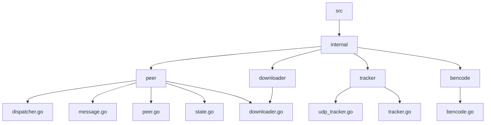

# Torrent Client in Go

## 🗂️  Description

This project implements a torrent client in Go, allowing users to download torrent files. The client supports connecting to trackers, downloading pieces from peers, and handling errors. The project is designed to be efficient and scalable, with a focus on concurrent programming and pipelined downloading.

The client is suitable for developers and users who want to understand the BitTorrent protocol and implement a torrent client from scratch. The project provides a basic implementation of the protocol, including tracker queries, peer connections, and piece downloading.

## ✨ Key Features

* **Tracker Support**: The client supports querying trackers for peer information using the UDP tracker protocol.
* **Peer Connections**: The client establishes connections to peers and handles handshake messages.
* **Piece Downloading**: The client downloads pieces from peers using a pipelined approach.
* **Error Handling**: The client handles errors and disconnections during the download process.
* **Concurrent Programming**: The client uses goroutines and channels to manage concurrent downloading and error handling.

## 🗂️ Folder Structure

## 🛠️ Tech Stack

## ⚙️ Setup Instructions

To run the project locally, follow these steps:

* Clone the repository: `git clone https://github.com/ASHUTOSH-SWAIN-GIT/torrent.git`
* Navigate to the repository: `cd torrent`
* Run the program: `go run main.go`

Note: Make sure you have Go installed on your system.

## 📝 Code Structure

The project consists of several packages:

* `internal/peer`: Peer connection and handshake logic.
* `internal/tracker`: Tracker queries and peer information.
* `internal/bencode`: Bencode decoding and encoding.
* `internal/downloader`: Downloading pieces and handling errors.

Each package has its own set of functions and structs, which are used to implement the torrent client.

## 🤝 GitHub Actions

The project uses GitHub Actions for continuous integration and testing. The workflow file is located in the `.github/workflows` directory.

## 📊 Testing

The project includes unit tests and integration tests to ensure the correctness of the implementation. The tests can be run using the `go test` command.

## 🚀 Future Work

Future work includes:

* Implementing more advanced features, such as seeding and peer prioritization.
* Improving performance and scalability.
* Adding support for more tracker protocols.

  

<h3>LowKeyDevs</h3>

No information provided.

 

  <a href="https://gitfull.vercel.app">Made by GitFull</a>

    